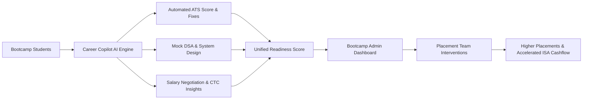
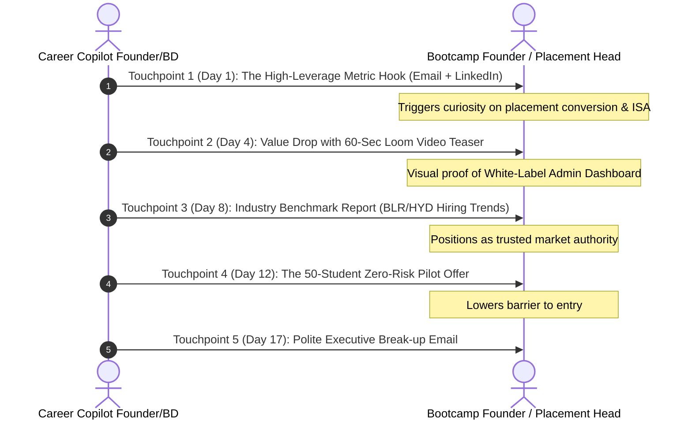

# 🎓 Career Copilot: B2B Institutional Sales Kit & Bootcamp Playbook

An institutional sales engine tailored for **Indian Tech Bootcamps, EdTechs, and Engineering Placement Cells** (e.g., Masai School, Scaler Academy, Coding Ninjas, AlmaBetter, AccioJob, Geekster, Guvi).

---

## 🎯 Executive Summary & Strategic Context

### The Macro Problem in Indian Tech Bootcamps (2024–2026)
1. **The Tech Winter & Placement Compression**: IT service firms froze mass hiring; startups raised bar for SDE-1/Full-stack hires. Placements take 5–9 months vs 2–3 months previously.
2. **ISA (Income Share Agreement) Default Risk**: When graduates don't get placed above the minimum threshold (e.g., ₹5 LPA), bootcamps cannot collect tuition fees.
3. **Manual Career Services Burnout**: In-house career teams drown in manual resume reviews, unstandardized mock interviews, and ad-hoc WhatsApp tracking.
4. **The Career Copilot Arbitrage**: For **₹250–₹500 ($3–$6) per student/month**, bootcamps get an enterprise-grade AI Career Coach, white-labeled portal, ATS optimizer, and unified Placement Admin Dashboard that boosts placement rates by 20–25% while slashing staff hours by 60%.



---

## 📑 Section 1: The 10-Slide Pitch Deck Architecture

*Designed for 16:9 presentation slides to Founders, CXOs, and Heads of Placements.*

---

### Slide 1: Title & Positioning
- **Header**: Supercharging Tech Placements with AI Career Intelligence
- **Subheader**: Turn 70% Placement Rates into 90%+ While Cutting Career Services Overhead in Half
- **Badge**: Purpose-Built for Indian Coding Bootcamps & Placement Cells
- **Visual**: Split mockup showing Student Copilot View (Mobile/Web) on left and Institutional Admin Command Center on right with bootcamp's custom logo.
- **Presenter Talking Point**: *"Every bootcamp promises high placement rates, but in today's cautious tech hiring market, traditional manual placement operations are buckling. Career Copilot gives your cohort institutional-grade career readiness from Day 1."*

---

### Slide 2: The Placement Bottleneck (The Problem)
- **Header**: Why Tech Placements Are Slower & More Expensive Than Ever
- **Three Pain Pillars**:
  1. **The ATS Filter Reality**: 74% of candidate resumes are rejected by automated ATS parsers at Swiggy, Flipkart, PhonePe, and MNCs before a human engineer ever reads them.
  2. **Unscalable Mentorship**: Paying external senior engineers ₹1,500–₹3,000 per mock interview is unsustainable at 500+ student cohort scales.
  3. **Blindspot Placement Operations**: Placement heads don't know who is failing interviews until the rejection email arrives. Tracking via Google Sheets is broken.
- **Stat Callout**: `62% of bootcamp graduates miss job offers due to interview soft-skills and non-optimized resumes, not lack of coding knowledge.`

---

### Slide 3: The Financial Bleed (ISA & Brand Risk)
- **Header**: The Real Cost of Unplaced Graduates
- **Calculated Impact (500 Student Cohort)**:
  - **Uncollected ISA Fees**: 100 unplaced students @ ₹1.5L ISA = **₹1.5 Crore ($180,000) lost revenue**.
  - **Placement Team Labor**: 5 Career Counselors @ ₹6L/yr = ₹30L/yr spent on repetitive formatting.
  - **Reputational Damage**: Student dissatisfaction on LinkedIn, Reddit (r/developersIndia), and Twitter damages next batch enrollment.
- **The Takeaway**: *"A 10% lift in placement velocity pays for our software 10x over in recovered ISA receivables alone."*

---

### Slide 4: Introducing Career Copilot Enterprise
- **Header**: The All-in-One Career Infrastructure for High-Growth Bootcamps
- **Key Modules**:
  1. **AI Resume Architect**: Tailored ATS parser and line-by-line bullet optimizer benchmarking against Indian tech company JDs.
  2. **Automated Technical & Behavioral Mock Coach**: Instant role-specific feedback across DSA, System Design, and Indian salary discussions.
  3. **Job Pipeline Tracker**: Real-time sync of student applications, stages, and upcoming rounds.
  4. **White-Label & Cohort Admin Engine**: Deployed under `careers.yourbootcamp.com` with custom branding.

---

### Slide 5: Student Experience & Feature Suite
- **Header**: Empowering Every Student with a 24/7 Personal Career Coach
- **Four Cornerstones**:
  | Feature | What Student Gets | Institutional Benefit |
  | :--- | :--- | :--- |
  | **ATS Resume Checker** | Instant score (0–100), missing keywords, action-verb impact analysis | Zero staff time spent proofreading formatting |
  | **Indian Market CTC Intelligence** | Bengaluru/Hyderabad/Gurugram CTC benchmarks by tech stack | Calibrates realistic salary targets, reduces offer rejections |
  | **AI Mock Interview Coach** | Voice/Text simulation with transcript analysis & rubric grading | Scales unlimited interview prep without paying human contractors |
  | **Personal Study & Prep Planner** | Day-by-day roadmap targeting company-specific patterns | Higher student discipline and task completion |

---

### Slide 6: Institutional Command Center (Admin Dashboard)
- **Header**: Real-Time Cohort Visibility for Placement Directors
- **Key Dashboards**:
  - **Readiness Heatmap**: Identify at-risk students (readiness score < 60%) 4 weeks before hiring week.
  - **Application Velocity**: Track total applications submitted per student, response rates, and interview conversion ratios.
  - **Cohort Benchmarking**: Compare Batch A vs Batch B placement readiness by tech stack (MERN, Java Backend, Data Engineering).
  - **Automated CSV/LMS Export**: One-click sync with Moodle, Canvas, or custom internal portals.

---

### Slide 7: Quantifiable Business ROI
- **Header**: The Math Behind the Partnership
- **ROI Formula for a 500-Student Batch**:
  ```
  + 15% Placement Rate Improvement  --> 75 additional students placed
  75 Students × ₹1.5L ISA Collection --> ₹1.12 Crore ($135,000) Recovered Revenue
  - Annual Career Copilot License   --> ₹15 Lakhs ($18,000)
  = Net Bottom-Line Gain             --> ₹97 Lakhs (~$117,000) Net Profit (7.5x ROI)
  ```
- **Operational Savings**: 1,200+ hours saved in manual mock interviews and resume reviews per cohort.

---

### Slide 8: Enterprise Security, Reliability & White-Labeling
- **Header**: Built for Enterprise Trust & Compliance
- **Key Specifications**:
  - **Custom Subdomain & Identity**: `careers.bootcamp.com` with full institutional color palette and logos.
  - **Data Privacy & Student Protection**: ISO/SOC2-ready cloud hosting, SSL encryption, zero public training on student resumes.
  - **Granular Role-Based Access Control (RBAC)**: Super Admin (Founder/COO), Placement Coordinators, Mentors, and Students.
  - **Zero IT Friction**: Deploys in under 48 hours via simple CSV upload or REST API webhook sync.

---

### Slide 9: Transparent Partnership Tiers
- **Header**: Flexible Pricing Aligned with Your Batch Economics
- **Pricing Options**:
  1. **Pilot Batch (Up to 100 students)**:
     - ₹399/student/month (or ₹1,999/student one-time for 6-month placement cycle).
     - Full AI features + basic admin dashboard.
  2. **Institutional Growth (500–1,500 students)**:
     - ₹299/student/month (or ₹1,499/student 6-month license).
     - Custom white-labeling, dedicated account manager, custom LMS integration.
  3. **Enterprise Campus (1,500+ students / Annual Master Contract)**:
     - Custom volume pricing (₹199–₹249/student/month).
     - Custom AI prompt training tailored to bootcamp's specific hiring partner criteria.

---

### Slide 10: The 14-Day Zero-Risk Pilot & Call-to-Action
- **Header**: Launch Your Pilot Batch in 14 Days
- **Milestones**:
  - **Day 1–3**: Brand asset handoff & white-label instance configuration.
  - **Day 4–7**: CSV import of 50 pilot students & 30-minute placement team briefing.
  - **Day 8–14**: Live student usage, resume score baseline analysis, and first cohort readiness report.
- **CTA**: *"Let’s run a 30-day proof-of-concept on your upcoming graduating batch. If your average resume score doesn't jump 25 points in 14 days, you pay nothing."*

---

## 📬 Section 2: Multi-Touch Cold Outreach Playbook

Targeting **Bootcamp Founders, Co-Founders, Chief Operating Officers, and Heads of Placements**.



---

### Touchpoint 1: The High-Leverage Hook (Day 1)

#### Variant A: To Bootcamp Founders / CEOs (Focus on ISA & Margin)
- **Subject**: Scaling [Bootcamp Name]'s placement velocity in this market
- **Body**:
```text
Hi [First Name],

Watching [Bootcamp Name]'s growth in the tech education space has been impressive—especially how your curriculum emphasizes practical engineering rigor.

However, talking to leaders across Indian tech bootcamps over the past quarter, almost everyone is feeling the same friction: companies like Swiggy, PhonePe, and tier-1 startups are filtering out 70%+ of candidate resumes at the ATS layer before an engineer ever looks at GitHub projects.

When students stay unplaced for 6+ months, uncollected ISA fees quickly add up to tens of lakhs in unrecovered cash flow.

We developed Career Copilot’s Enterprise Suite to solve this directly for bootcamps:
• Automated ATS resume optimization tuned for Indian tech stacks
• AI-powered mock interviews that eliminate expensive contractor fees
• An Institutional Dashboard that alerts your placement team to at-risk students 30 days before demo day

Cohorts using our platform have seen a 25% increase in first-round interview shortlists.

Could I share a 2-minute video walkthrough of how our white-labeled platform looks for a 500-student batch?

Best regards,

[Your Name]
Founder, Career Copilot
[Your Phone Number / LinkedIn Profile]
```

#### Variant B: To Head of Placements / Career Services (Focus on Workload)
- **Subject**: Quick question regarding [Bootcamp Name]'s placement prep workflow
- **Body**:
```text
Hi [First Name],

I know your team is currently deep in the trenches preparing the upcoming batch for placements.

Most Placement Heads I speak with tell me their biggest bottleneck is manual review: spending 300+ hours proofreading resumes, chasing students on WhatsApp for missing portfolio links, and arranging expensive mock interviews.

We built an institutional career preparation engine that automates 80% of this grunt work:
1. Students get instant ATS scoring (with exact keywords matching Indian SDE-1 and Full-Stack JDs).
2. Unlimited AI mock interview coaching with actionable rubrics.
3. Your team gets a central dashboard showing real-time readiness scores across every student in the batch.

Would you be open to a quick 15-minute demo this Thursday or Friday to see if this could save your team 20+ hours a week?

Best,

[Your Name]
Career Copilot | [Calendar Link]
```

---

### Touchpoint 2: The Value Drop & Video Teaser (Day 4)

- **Subject**: Re: Scaling [Bootcamp Name]'s placement velocity (Quick 60s demo)
- **Body**:
```text
Hi [First Name],

Following up on my note from Tuesday. I recorded a quick 60-second Loom showing exactly what the institutional dashboard looks like when plugged into an Indian engineering cohort:

[Link: Loom Video - "Career Copilot 60-Second Institutional Walkthrough"]

Key highlights in the video:
• How our ATS parser catches missing indexing keywords for Bengaluru & Hyderabad tech employers.
• The "Readiness Heatmap" that flags students who need placement intervention before they burn company interviews.
• The custom white-label branding tailored for [Bootcamp Name].

Happy to give you a sandbox login to test it with 3 of your mentors. Does [Day, e.g., Tuesday at 3:00 PM IST] work for a quick look?

Best,

[Your Name]
```

---

### Touchpoint 3: The Benchmark Report & Social Proof (Day 8)

- **Subject**: 2026 Indian Tech Hiring Bar: Data from 1,200+ SDE-1 Job Descriptions
- **Body**:
```text
Hi [First Name],

Whether we end up working together or not, I wanted to share a quick piece of market intelligence our engineering engine aggregated this month across top Indian product startups (Bangalore, Pune, Gurgaon, Hyderabad):

1. 82% of SDE-1 job postings now filter out resumes that lack concrete business metrics (e.g., latency reduction, throughput, users served) in bullet points.
2. System design and architectural basics are now being tested in Round 1 for junior engineers, not just senior roles.
3. Salary negotiation gaps are causing a 15% drop-off in accepted offers due to unrealistic student expectations vs. current market CTC bands.

Career Copilot automatically guides students through these exact three hurdles before they ever interview with your hiring partners.

If you’d like to see how your current cohort stacks up against these benchmarks, I can set up a free 20-student trial for [Bootcamp Name] this week.

Let me know if that sounds interesting!

Best,

[Your Name]
```

---

### Touchpoint 4: The 14-Day Zero-Risk Pilot Offer (Day 12)

- **Subject**: Proposal: 30-Day Zero-Risk Pilot for [Bootcamp Name]'s next cohort
- **Body**:
```text
Hi [First Name],

I know introducing any new software into an ongoing bootcamp curriculum requires careful thought.

To make this completely risk-free for [Bootcamp Name], here is our pilot proposition:
• We provision a custom-branded instance of Career Copilot for 50 of your upcoming graduates for 30 days.
• We onboard your placement coordinators in a 30-minute training call.
• Your students get unlimited resume optimizations, mock interviews, and CTC benchmarking.
• If your cohort’s average ATS readiness score doesn't increase by at least 25% within 14 days, you owe us nothing.

If you like the results, we can discuss a subsidized rollout for the full batch.

Would you be open to reviewing the pilot terms on a 15-minute call this week?

Here’s my direct calendar: [Calendly Link]

Best,

[Your Name]
```

---

### Touchpoint 5: The Respectful Breakup (Day 17)

- **Subject**: Closing the loop / Career Copilot for [Bootcamp Name]
- **Body**:
```text
Hi [First Name],

I assume your team has your hands full optimizing placements internally right now, so I don't want to clutter your inbox further.

I’ll step back for now. If you ever want to explore how AI-driven interview readiness and automated ATS prep can help [Bootcamp Name] boost placement rates and protect ISA revenue, feel free to reach out anytime.

You can always test the platform yourself at https://careercopilot.io.

Wishing [Bootcamp Name] and your graduates immense success this season!

Warm regards,

[Your Name]
Founder, Career Copilot
```

---

## 📱 Section 3: LinkedIn Social Selling Scripts

### LinkedIn Connection Request (Under 300 Characters)
```text
Hi [First Name], admiring [Bootcamp Name]’s impact on tech careers in India. We built an AI career engine that helps bootcamps boost placement shortlists by 25% and automate manual resume reviews. Would love to connect and share notes on the 2026 hiring market!
```

### LinkedIn DM (After Connection Accepted)
```text
Thanks for connecting, [First Name]!

Saw that [Bootcamp Name] recently launched your new [Full Stack / Backend] batch.

We’ve been collaborating with tech placement cells to tackle the biggest headache right now: getting student resumes past initial ATS filters without placement coordinators spending hundreds of hours on manual reviews.

Curious: how is your team currently tracking student interview readiness before sending them to hiring partners?
```

---

## 🎙️ Section 4: 20-Minute Discovery Call Framework

| Time | Goal | Action & Verbatim Prompts |
| :--- | :--- | :--- |
| **00:00 - 03:00** | **Rapport & Framing** | *"Thanks for taking the time, [Name]. Goal for today is simple: learn about [Bootcamp Name]'s current placement workflow, show you a 7-minute look at how our platform automates it, and see if a pilot makes sense."* |
| **03:00 - 08:00** | **Discovery (Pain Uncovering)** | 1. *"What percentage of your students make it past the first ATS resume screen with your hiring partners?"*<br>2. *"How many hours does your team spend reviewing resumes and doing mock interviews per batch?"*<br>3. *"How do you currently track which students are at risk of not getting placed before hiring week?"* |
| **08:00 - 15:00** | **Tailored Demo** | **Show 3 Specific Flows**:<br>1. *Student POV*: Paste a real SDE-1 JD, upload a student resume, watch ATS score jump from 52 to 88 with tailored keyword fixes.<br>2. *AI Mock Coach*: Run a mock interview question with real-time feedback.<br>3. *Admin Dashboard*: Show the cohort heatmap and at-risk student filter. |
| **15:00 - 18:00** | **Commercials & ROI Anchor** | *"For a batch of 200 students, your investment is roughly ₹50,000/month. If that helps place just ONE additional student under an ISA, the platform has completely paid for itself."* |
| **18:00 - 20:00** | **Close on Pilot** | *"Let's do this: we'll set up a 30-day pilot for 50 students starting Monday. We'll measure the baseline ATS score on Day 1 and re-evaluate on Day 14. Can I send over the 1-page pilot agreement today?"* |

---

## 🛡️ Section 5: Objection Handling Playbook

### Objection 1: "We already have internal mentors and alumni doing mock interviews."
> **Response**: *"Alumni mentors are fantastic for high-touch human feedback, but they don't scale. If you have 300 students, giving each student 5 mock interviews requires 1,500 mentor hours. That costs lakhs and creates scheduling nightmares. Career Copilot handles the first 5–10 foundational reps so that when your students finally sit with your alumni, they are polished, confident, and ready for high-level technical nuances."*

### Objection 2: "Our budgets are completely frozen for new software right now."
> **Response**: *"Totally understand, especially given cautious market conditions. That's why we frame Career Copilot not as an operational software expense, but as an **ISA revenue recovery tool**. Every month a student remains unplaced, your cost of capital and uncollected receivables increase. If Career Copilot accelerates your average time-to-placement by just 3 weeks, it yields a direct positive cash return. Plus, our pilot costs ₹0 upfront to validate."*

### Objection 3: "Can you integrate with our existing LMS / portal (Moodle / Canvas / Custom)?"
> **Response**: *"Yes. We offer turnkey SSO (Single Sign-On) and CSV cohort synchronization. Students can access Career Copilot through your custom branded subdomain (e.g., `prep.yourbootcamp.com`) using their existing email credentials, with zero manual overhead for your tech team."*

### Objection 4: "Students can just use free ChatGPT or Gemini directly."
> **Response**: *"Students can prompt ChatGPT, but generic AI doesn't know Indian tech market CTC benchmarks, doesn't parse specific ATS algorithms with rubric grading, and most importantly: **ChatGPT gives your placement team zero visibility**. With Career Copilot, your placement coordinators see who is practicing, who is failing, and who is ready to be sent to recruiters."*

---

## 📋 Section 6: Next Steps & Immediate Execution Checklist

- [ ] **Step 1**: Finalize custom logo and brand assets for demo instances.
- [ ] **Step 2**: Build target list of 50 Indian Tech Bootcamps using LinkedIn Sales Navigator & Crunchbase.
- [ ] **Step 3**: Launch Touchpoint 1 cold email cadence to top 20 bootcamps (Scaler, Masai, Coding Ninjas, AlmaBetter, AccioJob, etc.).
- [ ] **Step 4**: Record 60-second personalized Loom video demonstrating the white-label portal.
- [ ] **Step 5**: Schedule first 3 discovery calls and lock in a 14-day pilot agreement.
