# Database Schema Documentation

Career Copilot utilizes PostgreSQL managed via Sequelize ORM with relational modeling, foreign key constraints, indexes, and automatic timestamp tracking.

---

## 🗄️ Entity Relationship Diagram

```mermaid
erDiagram
    USERS ||--o{ RESUMES : owns
    USERS ||--o{ JOBS : tracks
    USERS ||--o{ USER_SKILLS : possesses
    USERS ||--o{ STUDY_PLANS : follows
    USERS ||--o{ CODING_PROBLEMS : solves
    USERS ||--o{ MOCK_INTERVIEWS : completes

    ROLES ||--o{ ROLE_SKILLS : requires
    SKILLS ||--o{ ROLE_SKILLS : mapped_to
    SKILLS ||--o{ USER_SKILLS : references
    ROLES ||--o{ QUESTIONS : contains

    USERS {
        uuid id PK
        string full_name
        string email UK
        string password_hash
        string target_role
        string avatar_url
        timestamp created_at
        timestamp updated_at
    }

    RESUMES {
        uuid id PK
        uuid user_id FK
        string file_name
        string file_path
        text extracted_text
        jsonb parsed_sections
        float ats_score
        jsonb matched_keywords
        jsonb missing_keywords
        timestamp created_at
    }

    JOBS {
        uuid id PK
        uuid user_id FK
        string company_name
        string position_title
        string job_url
        string location
        string salary_range
        string status "Wishlist|Applied|Interviewing|Offer|Rejected"
        date deadline
        jsonb notes
        timestamp applied_date
        timestamp created_at
        timestamp updated_at
    }

    SKILLS {
        uuid id PK
        string name UK
        string category "Languages|Frameworks|Tools|Concepts|Cloud"
        text description
    }

    USER_SKILLS {
        uuid id PK
        uuid user_id FK
        uuid skill_id FK
        string proficiency_level "Beginner|Intermediate|Advanced|Expert"
        integer verified_score
        timestamp updated_at
    }

    STUDY_PLANS {
        uuid id PK
        uuid user_id FK
        string title
        string target_role
        integer duration_weeks
        integer target_hours_per_week
        jsonb weekly_milestones
        float completion_percentage
        boolean is_active
        timestamp created_at
        timestamp updated_at
    }

    CODING_PROBLEMS {
        uuid id PK
        uuid user_id FK
        string title
        string platform "LeetCode|HackerRank|Codeforces|Other"
        string difficulty "Easy|Medium|Hard"
        string topic "Arrays|Trees|DP|Graphs|Strings|..."
        string status "Solved|Attempted|Review"
        text solution_notes
        integer time_spent_minutes
        timestamp solved_at
    }

    MOCK_INTERVIEWS {
        uuid id PK
        uuid user_id FK
        string role
        string interview_type "Technical|Behavioral|System Design"
        jsonb questions_asked
        jsonb user_answers
        float overall_score
        jsonb feedback
        integer duration_minutes
        timestamp completed_at
    }
```

---

## 📋 Table Specifications

### 1. `users`
- Primary user identity, authentication, profile metadata, and target career path.
- Password hashes use `bcryptjs` with salt rounds = 10.

### 2. `resumes`
- Stores resume artifacts, parsed text from pdf-parse, extracted sections (education, work experience, projects, skills), ATS analysis score, and match discrepancies.

### 3. `jobs`
- Tracks the user's active job search lifecycle on a drag-and-drop Kanban interface.

### 4. `skills` & `user_skills`
- Catalog of verified technical skills across 20+ engineering specialties and mapping to the user's assessed mastery.

### 5. `study_plans`
- Generated customized study roadmaps based on identified skill gaps and user-specified timelines.

### 6. `coding_problems`
- Algorithmic practice logger with categorizations for deep weakness analytics.

### 7. `mock_interviews`
- Session records of interactive simulated technical and behavioral interviews with evaluation scoring.
