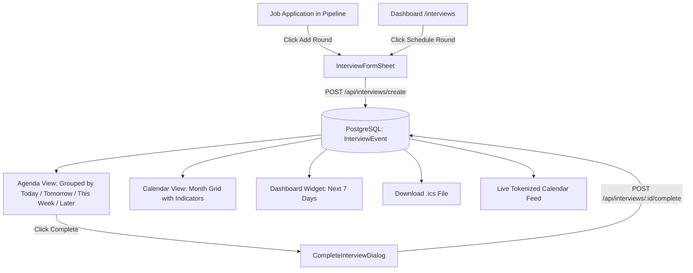

# Interview Tracker with Calendar Integration

## Overview
The **Interview Tracker with Calendar** feature empowers job seekers on Career Copilot to schedule and manage multi-round interview pipelines for every job application, record real-time feedback and outcomes, view upcoming interviews in an agenda and monthly calendar grid, and sync scheduled rounds seamlessly with external calendar apps (Google Calendar, Apple Calendar, Outlook) without requiring third-party OAuth permissions.

---

## 1. Data Model & Fields

### Database Entities (Prisma / PostgreSQL)

#### Enums
- **`InterviewType`**: `OA` | `TECHNICAL` | `HR` | `MANAGERIAL` | `SCREENING` | `OTHER`
- **`InterviewMode`**: `ONLINE` | `OFFLINE`
- **`InterviewStatus`**: `SCHEDULED` | `COMPLETED` | `CANCELLED` | `NO_SHOW`
- **`InterviewOutcome`**: `PASS` | `FAIL` | `PENDING` (nullable; set upon completion)

#### `InterviewEvent` Model
| Field | Type | Description |
|---|---|---|
| `id` | `String` (cuid) | Unique interview round identifier |
| `userId` | `String` | References `User.id` (tenant boundary & privacy) |
| `applicationId` | `String` | References `Application.id` (1:N application -> rounds) |
| `title` | `String` | Round name (e.g., "System Design Round 1", "HR Fit") |
| `type` | `InterviewType` | Category badge (default `TECHNICAL`) |
| `mode` | `InterviewMode` | `ONLINE` or `OFFLINE` |
| `scheduledStart` | `DateTime` | Timestamp of interview start |
| `durationMin` | `Int` | Duration in minutes (default 45) |
| `timezone` | `String` | Timezone identifier (default `Asia/Kolkata`) |
| `meetingLink` | `String?` | Zoom, Google Meet, or Teams video call URL |
| `location` | `String?` | Physical building / room address if offline |
| `interviewerName` | `String?` | Name / title of interviewer panel |
| `status` | `InterviewStatus` | `SCHEDULED`, `COMPLETED`, `CANCELLED`, or `NO_SHOW` |
| `outcome` | `InterviewOutcome?` | `PASS`, `FAIL`, or `PENDING` |
| `notes` | `String?` | Pre-interview preparation notes or questions |
| `feedback` | `String?` | Post-interview feedback or reflections |
| `createdAt` / `updatedAt` | `DateTime` | Automatic timestamp auditing |

#### `CalendarToken` Model
| Field | Type | Description |
|---|---|---|
| `id` | `String` (cuid) | Primary key |
| `userId` | `String` (unique) | References `User.id` |
| `token` | `String` (unique) | Cryptographically secure token (48-char hex) |
| `createdAt` / `updatedAt` | `DateTime` | Timestamp auditing |

---

## 2. Core Flows

### Scheduling & Management
1. **From `/interviews`**: Click **"Schedule Round"** to select an application and fill in title, date, duration, meeting link, and notes.
2. **From Application Details (`/applications`)**: Click **"Add Round"** next to an application. The form automatically pre-fills the company and role context.
3. **Completing an Interview**: Click **"Complete"** on any scheduled interview card to open the completion dialog, record whether you passed/failed/are awaiting feedback, and store reflection notes.

---

## 3. Calendar Export: ICS Download vs. Token Feed

We provide two distinct calendar integration methods designed with privacy and zero-friction setup in mind. Neither method requires Google or Microsoft OAuth approvals.

### Method 1: On-Demand ICS Download (`.ics` File)
- **Endpoint**: `GET /api/interviews/ics?scope=upcoming|all`
- **Authentication**: Required (NextAuth session or auth token).
- **Format**: `text/calendar` file attachment named `career-copilot-interviews.ics`.
- **Use Case**: Best for importing a static snapshot of interviews into offline calendars or one-time desktop imports.

### Method 2: Live Tokenized Calendar Feed (Webcal / HTTP Subscription)
- **Endpoint**: `GET /api/calendar/interviews/[token]`
- **Authentication**: No login cookies required; identified exclusively by the secret token in the URL.
- **Format**: Live `text/calendar` stream with `no-cache` headers.
- **Use Case**: Enables Google Calendar, Apple Calendar, and Outlook to continuously pull real-time updates whenever an interview is scheduled, rescheduled, or cancelled.

### RFC 5545 Compliance Rules
Every generated VEVENT includes:
- `DTSTART` and `DTEND` calculated from `scheduledStart` + `durationMin`
- `SUMMARY`: `"Interview: <Company> — <title>"`
- `DESCRIPTION`: Role, interview type, meeting link, and notes
- `LOCATION`: Video link if online, physical address if offline
- `X-WR-TIMEZONE`: `Asia/Kolkata`

---

## 4. Privacy, Security & Token Regeneration

### Privacy Guarantees
- The calendar feed endpoint (`/api/calendar/interviews/[token]`) exposes **only** interview calendar events belonging to the user who owns the token.
- No user credentials, passwords, or personal profile data are exposed.
- All database queries are strictly scoped by `userId`.

### Instant Revocation & Token Regeneration
- If a user shares their calendar feed URL or wants to revoke an old device's access, they can navigate to `/settings/calendar` and click **"Regenerate Token"**.
- This calls `POST /api/calendar/token/regenerate`, which:
  1. Generates a new 48-character cryptographically secure token using Node's `crypto.randomBytes(24).toString('hex')`.
  2. Updates the `CalendarToken` record in the database.
  3. Immediately invalidates the prior token, causing any requests using the old URL to return HTTP 404.

---

## 5. Subscribing in External Calendar Clients

1. **Google Calendar (Web)**:
   - On desktop, open Google Calendar.
   - On the left sidebar, click `+` next to **Other calendars** &rarr; select **From URL**.
   - Paste your private calendar feed link and click **Add calendar**.
2. **Apple Calendar (macOS / iOS)**:
   - macOS: Open Calendar &rarr; **File** &rarr; **New Calendar Subscription** &rarr; Paste URL.
   - iOS: **Settings** &rarr; **Calendar** &rarr; **Accounts** &rarr; **Add Account** &rarr; **Other** &rarr; **Add Subscribed Calendar**.
3. **Microsoft Outlook**:
   - Open Outlook Web &rarr; **Add calendar** &rarr; **Subscribe from web** &rarr; Paste URL.
